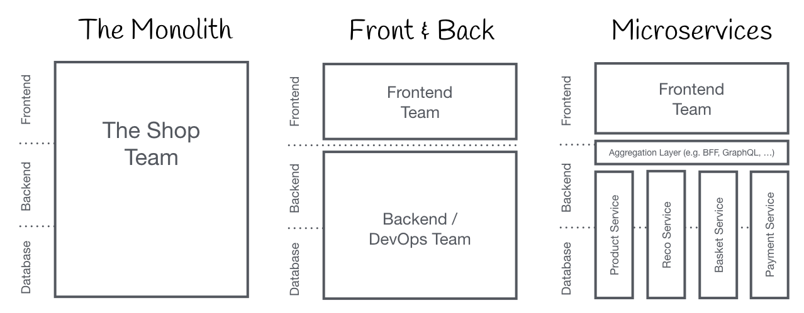
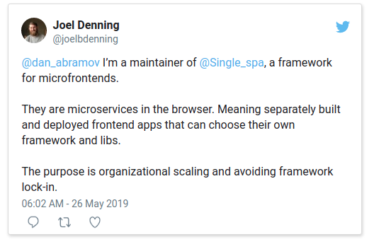
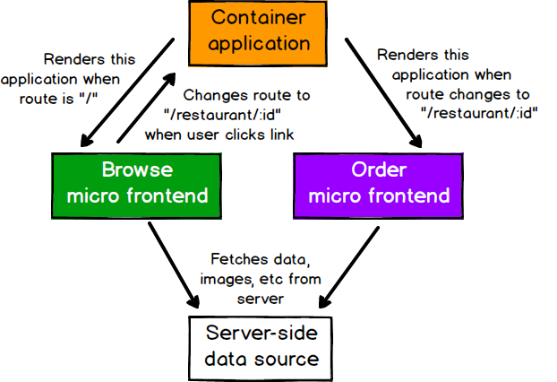
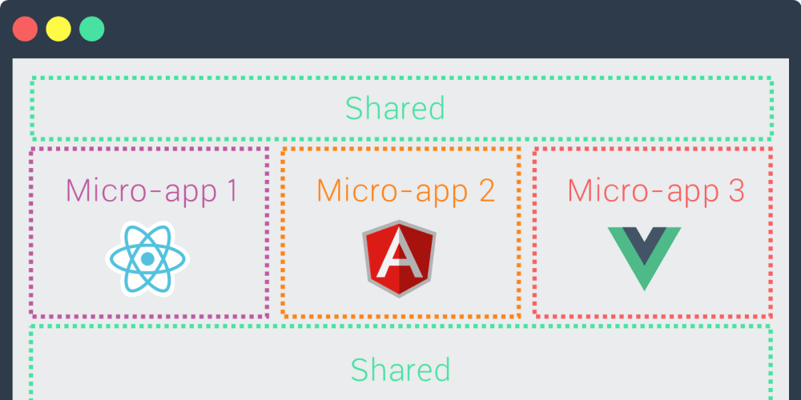
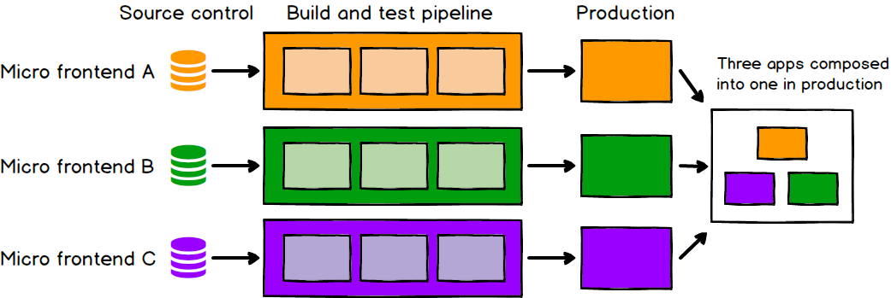

# Introduction

## Angular microfrontends 

Until now we have gone from monolith to microservices, but frontend granularization was lagging a bit

With recent development of Webpack 5, we can easier bring concept of microfrontends to production. Thanks to `@angular-architects/module-federation` we can also use Angular as our shell to contain other microfrontends

## Why to use microfrontends?

Quoted from **Scott Yeatts**

> I've been building a microfrontend for almost a year, and there are good points made around app-size/company size, etc.

> But the REAL benefits are avoiding framework lock-in and stability. If I build a microfrontend component (spec compliant web component) and package it up into an npm package, that component lives forever.

> I don't have to go back and modify it every time a new version of the framework comes out.

> In addition, think of it from the perspective of going framework-less, not in terms of the frameworks (as the microfrontend site example is pretty tortured). The whole POINT of these frameworks, going back a decade, was to allow us to separate concerns and componentize (work in the average jQuery app circa 2008 and you'll know what I mean haha). This isn't about using all the frameworks, this is about not needing them anymore.

> If everything is a purely contained component that can run on its own completely independently, then you have a design system, not an application.

> If you then compose a set of components into a larger "frame" component, and that frame has an API that it calls on the backend to where each microfrontend is a vertical slice of the application, then it becomes ridiculously trivial to make changes.

> You CAN do that with a good component model. Now, change the framework version in an app without a microfrontend.

> Example from the real world: Spend five years writing an Angular 1.X site with a bunch of element directives. Now you've finally convinced leadership we need to be using v6 or whatever it's gotten to now. That's a giant project, and one that keeps going every 6 months unless you're ok with eventually being on outdated, unsupported versions of the framework. With a microfrontend you just refactor a piece at a time, not the whole thing.

> The Angular 1 to 2 split was the most dramatic, but all frameworks introduce breaking changes at some point that prevent upgrades.

> With a microfrontend, if every component is on v1, and the new component is on v2 you can lazily update all other components as time allows without a giant refactor or greenfielding it from scratch (while potentially having a larger download size for a time)

> The different teams and different framework examples of the microfrontend site get in the way I think. The real point should be the ability to get away from using frameworks for everything (so obviously Dan isn't going to like it... Not in a conspiracy sort of way, but in a "React is the only answer" sort of mindset), the flexibility to use them if you actually NEED them, and the ability to have disparate pieces coexist on a page in spite of the fact that the developer in 2019 didn't care (or know) what the developer in 2025 was going to do.

> Also, just like on the backend, where in theory you could have Go, Node, Python and Java services, you could do the same on the frontend with the big three. Unless it's a google-sized shop, there will probably be pressure if not outright instructions to stick to a stack front and back in most cases.

## Concept

Split frontend on individual micro apps that are put together by shell/container app

but they communicate with backend on their own.

Here we can introduce shared libs, ie for styling

## Use cases

- **Applications are autonomous:** each app has its own responsibility so we split bigger app on smaller remote modules for faster development. 

- **Applications can be developed independently:** each team can focus solely on their own micro-frontend

- **Applications can be deployed independently:** we do not have to wait for other microfrontends  remote modules for compilation

- **Applications can be implemented in different technologies:** integrate seamlessly different frameworks
